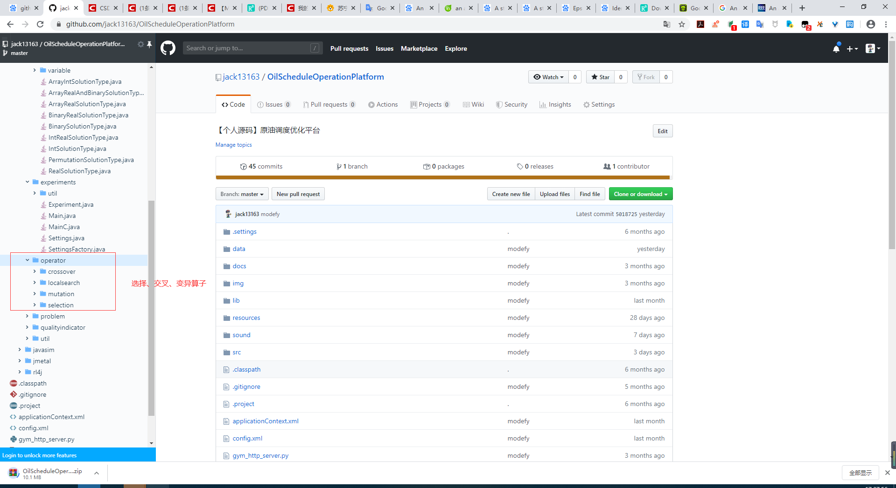
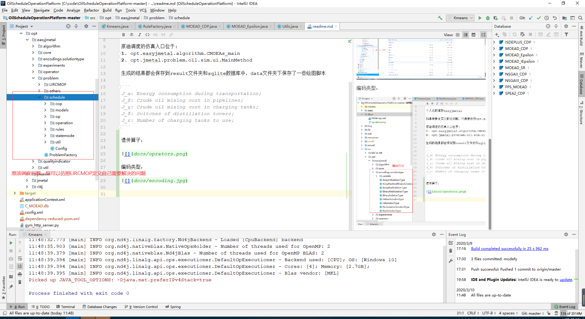
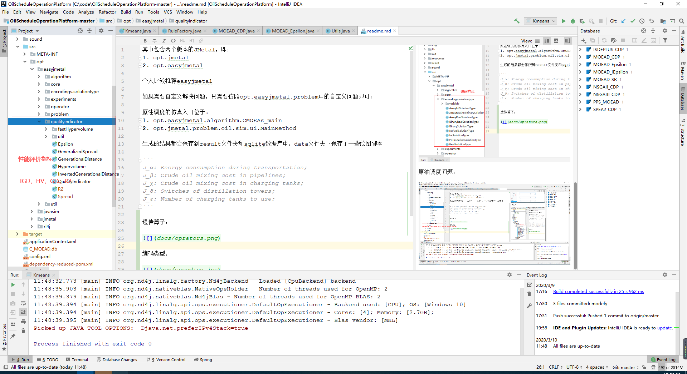
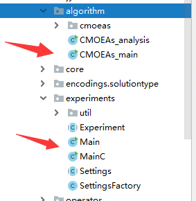
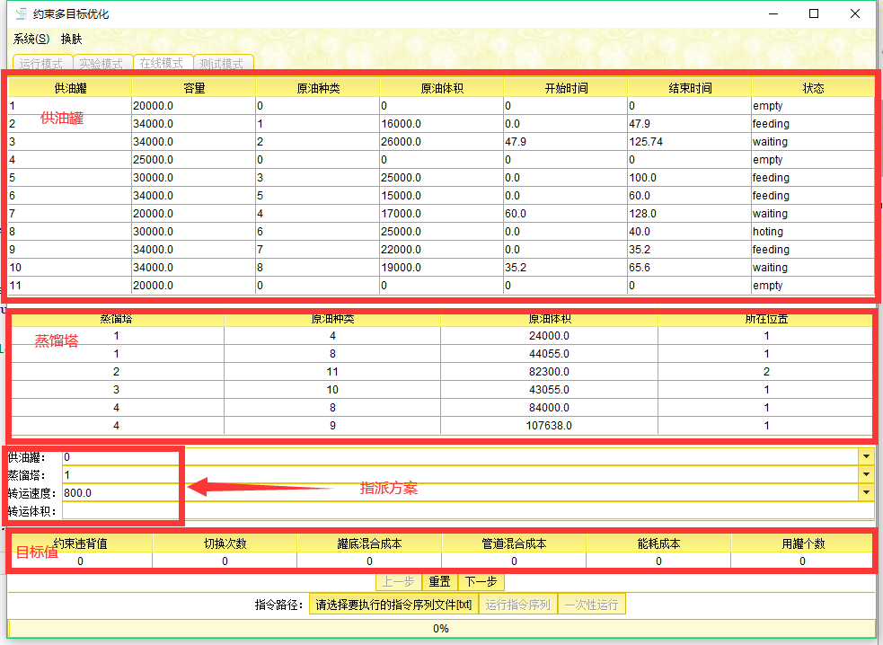
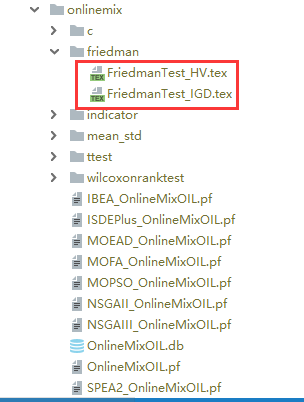
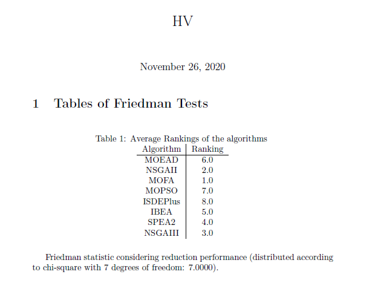

其中包含两个版本的JMetal，即：
1. opt.jmetal
2. opt.easyjmetal

个人比较推荐easyjmetal

如果需要自定义解决问题，只需要仿照opt.easyjmetal.problem中的自定义问题即可；

原油调度的仿真入口位于:
1. opt.easyjmetal.algorithm.cmoeas.enter.CMOEAs_main
2. opt.jmetal.problem.oil.sim.ui.MainMethod

生成的结果都会保存到result文件夹和sqlite数据库中，data文件夹下保存了一些绘图脚本

```
J_α: Energy consumption during transportation;
J_β: Crude oil mixing cost in pipelines;
J_χ: Crude oil mixing cost in charging tanks;
J_δ: Switches of distillation towers;
J_ε: Number of charging tanks to use;
```

遗传算子：



编码类型：


原油调度问题：



评价指标：



如何进行实验：



单步仿真：



指标生成为tex文档，利用texlive自动生成pdf文档：

```java
String[] algorithmNames = {"NSGAII_CDP", "ISDEPLUS_CDP", "NSGAIII_CDP", "MOEAD_CDP", "MOEAD_IEpsilon", "MOEAD_Epsilon", "MOEAD_SR", "C_MOEAD", "PPS_MOEAD"};
String[] problemNames = {"EDF_PS", "EDF_TSS"};
String[] indicatorNames = {"HV", "IGD"};
int runtimes = 2;
String basePath = "result/easyjmetal/twopipeline/";

// 生成pareto前沿面
ParetoFrontUtil.generateParetoFront(algorithmNames, problemNames, runtimes, basePath);
// 计算性能指标
ParetoFrontUtil.generateQualityIndicators(algorithmNames, problemNames, indicatorNames, runtimes, basePath);

// Friedman测试
Friedman.executeTest("HV", algorithmNames, problemNames, basePath);
Friedman.executeTest("IGD", algorithmNames, problemNames, basePath);

// 生成均值和方差
MeanStandardDeviation generateLatexTables = new MeanStandardDeviation(algorithmNames, problemNames, indicatorNames, basePath);
generateLatexTables.run();

// 进行TTest
TTest tTest = new TTest(algorithmNames, problemNames, indicatorNames, basePath);
tTest.run();

// 进行TTest
WilcoxonSignedRankTest wilcoxonSignedRankTest = new WilcoxonSignedRankTest(algorithmNames, problemNames, indicatorNames, basePath);
wilcoxonSignedRankTest.run();

// 计算不同策略C指标
CMetrics cMetrics = new CMetrics(problemNames, algorithmNames,runtimes, basePath);
cMetrics.run();
```






感谢：

[广东省数字信号与图像处理技术重点实验室](http://imagelab.stu.edu.cn/Content.aspx?type=content&Content_ID=5440)

[郑州大学计算智能实验室](http://www5.zzu.edu.cn/cilab/Benchmark/dmbyhcsj.htm)

[Java多目标框架Jmetal](https://github.com/jMetal/jMetal)
